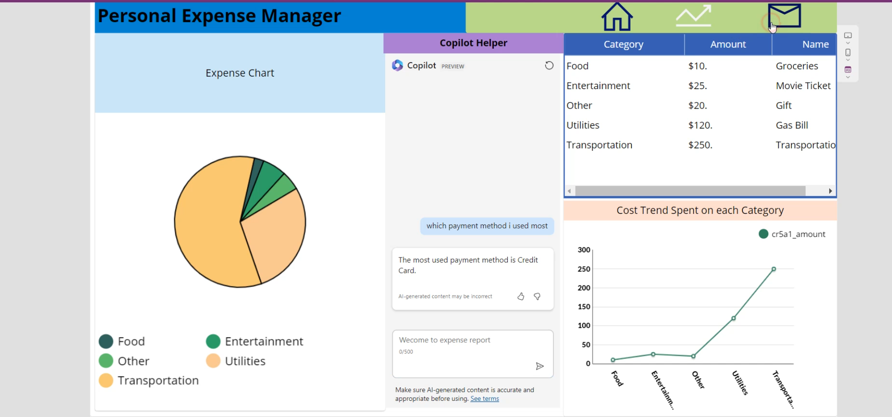
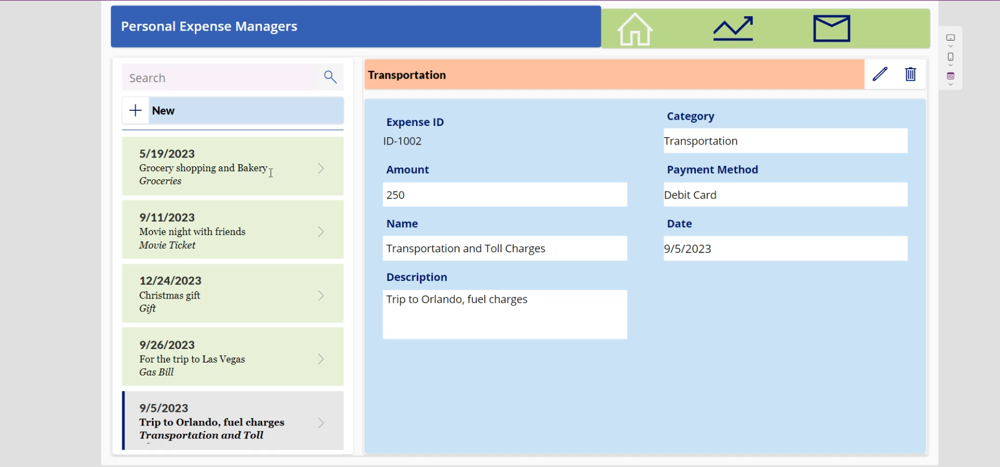
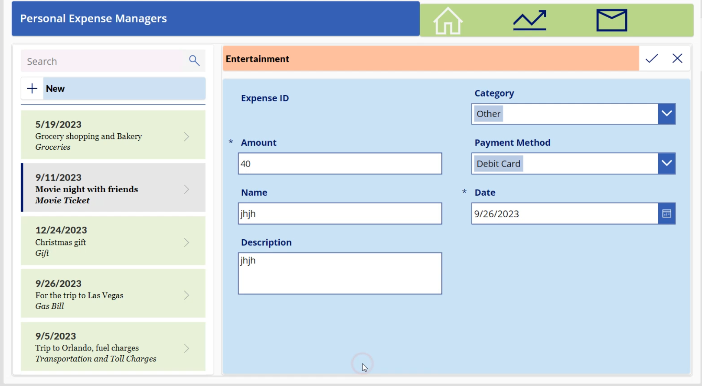
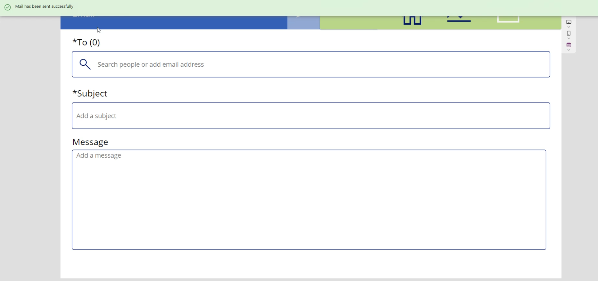

📊 Personal Expense Manager
An intelligent, AI-powered expense tracking app built using Power Apps, Copilot, and Microsoft Dataverse. This application allows users to add, view, edit, and delete expenses, visualize expense trends, and interact with an AI assistant (Copilot) to gain insights from the data.

🔧 Built With
Microsoft Power Apps – Low-code/no-code platform to build custom business apps.

Microsoft Copilot (Preview) – Embedded AI assistant to answer queries based on app data.

Dataverse – Cloud-based storage to manage structured data.

Power Automate (optional for email reminders or automation)

Power BI (optional for advanced analytics)

💡 Key Features
Feature	Description
Add/Edit/Delete Expenses	Input and manage details like category, amount, date, and payment method.
Category-wise Breakdown	View a pie chart of total expenses per category (Food, Utilities, Transport, etc.).
Cost Trend Line Chart	Visualize trends in your spending habits.
Copilot Integration	Ask natural language questions like “Which payment method did I use most?” and get instant insights.
Search & Filter	Quickly locate any expense by description or category.
Email Feature	Send an email with expense summaries (via Power Automate - optional).
🚀 Getting Started
Clone the Repo:

This app was built and exported from Power Apps.

To use it, open Power Apps, go to Apps > Import Canvas App, and select the .msapp file (provided separately).

Configure Dataverse Table:

Create or import the Dataverse table used for storing expenses.

Make sure your column names match those in the Power App.

Enable Copilot:

Go to Power Apps Studio, turn on the Copilot preview, and connect it to the dataset.

Provide a short description of the dataset to help Copilot understand the context.

🧠 Sample Copilot Queries
“What was my highest expense last month?”

“Which category had the most spending?”

“Show all expenses related to travel.”

“Which payment method did I use most?”

📸 Screenshots

🔒 Security & Best Practices
Role-based access can be configured in Power Apps environment.

Copilot’s AI-generated responses should be verified before taking decisions.
